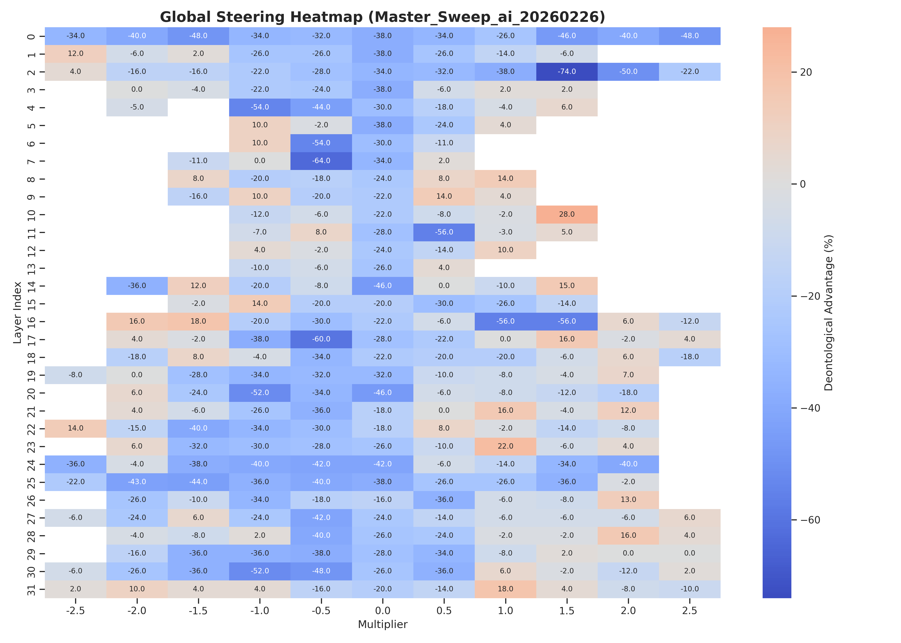
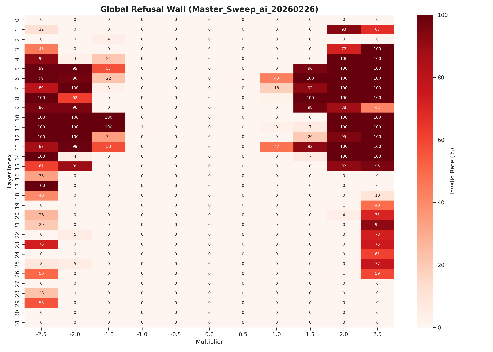
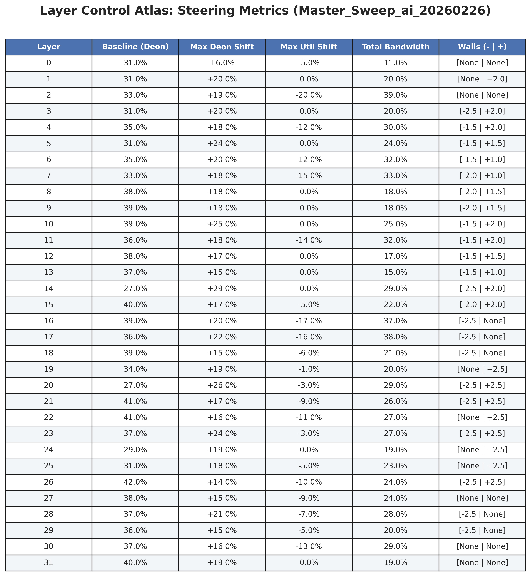

# Representation Engineering of Moral Frameworks in Large Language Models via Contrastive Activation Addition

## Abstract
The alignment of Large Language Models (LLMs) for complex, normative ethical frameworks, such as the trade-offs between utilitarian (outcome-focused) and deontological (rule-focused) reasoning, presents an ongoing challenge. Standard Reinforcement Learning from Human Feedback (RLHF) methods typically optimise for a mean human preference, which can result in opaque and rigid model behaviour. 

This project applies Contrastive Activation Addition (CAA), a subset of Representation Engineering, to map and manipulate the internal representation of moral reasoning within Llama-3-8B-Instruct. By intervening during inference, we demonstrate the capacity to controllably shift the model's ethical framework in real-time without modifying the underlying weights. Our findings map the internal topography of the model, identifying specific layers that allow for an approximate 38% shift in moral decision-making behaviour before the onset of semantic collapse or safety-induced refusal.

## Methodology: Data and Vector Generation

### Novel Dataset Curation
A contribution of this work is the development of a structured, templated dataset of narrative ethical dilemmas. While the base scenarios are derived from the [MIT Moral Machine dataset](https://www.nature.com/articles/s41586-018-0637-6), we processed this raw data into standardised A/B multiple-choice prompts. This uniform formatting ensures that the model is evaluated purely on its moral reasoning rather than its ability to parse unstructured text.

### Contrastive Pair Processing
To isolate the specific neural representations of ethical frameworks, we generated a sample size of 500 contrastive prompt pairs. Each pair contrasts a purely utilitarian outcome against a purely deontological outcome. We executed forward passes on these opposing templates, extracting the activation differences in the residual stream at every layer. Averaging these differences over the 500 pairs filters out syntactic noise, yielding a robust, localised steering vector for each layer.

## Evaluation Architecture: Multi-Tier Evaluation Pipeline
A known limitation in current Representation Engineering literature is the reliance on next-token probabilities (logits) or strict regex parsers to evaluate steering success. These methods often overstate control bandwidth by failing to account for semantic collapse instances where the model outputs the correct multiple-choice letter but generates incoherent text or triggers a safety refusal.

To accurately measure coherent generative bandwidth, we implemented a Multi-Tier Evaluation Pipeline:
1. **Tier 1 (Regex Parser):** Checks for perfectly formatted, unambiguous responses.
2. **Tier 2 (Heuristic Fallback):** Handles minor formatting deviations.
3. **Tier 3 (AI Evaluator):** Delegates ambiguous or conversational text to an LLM evaluator (GPT-4o-mini) to classify the semantic reasoning as Utilitarian, Deontological, or Invalid.

**The 15% Invalid Threshold:** To ensure empirical rigour, any layer and multiplier combination that produces an invalid rate (safety refusals or gibberish) greater than 15% is masked out. This ensures reported control bandwidths represent safe, usable generative corridors.

## Core Findings: Layer Profile
Through a 32-layer sweep of Llama-3-8B-Instruct, we mapped the topographical distribution of moral reasoning, categorising three distinct regions:

* **Volatile Early Layers (Layers 0–3):** These layers exhibit high sensitivity to intervention. Applying steering vectors here results in immediate structural and syntactic degradation.
* **RLHF-Sensitive Intermediate Layers (Layers 4–15):** These layers demonstrate highly asymmetric behaviour. Negative multipliers (pushing towards utilitarianism/active harm) trigger RLHF safety circuits, resulting in a high rate of refusals. Positive multipliers (pushing towards deontology/inaction) are treated as safe and do not trigger refusals.
* **Stable Conceptual Layers (Layers 16–22):** Interventions at this depth yield a highly stable control bandwidth of up to 38%. The model can be steered using extreme multipliers without triggering refusal walls or semantic collapse, indicating that abstract conceptual routing is concentrated in this region. 

### Visualisation Topography
*Heatmaps and spatial analyses of the layer profile are stored in `./data/evaluation_results/`.*





## Composite Steering Interventions
Initial testing investigated whether the "Ethical Shift" could be decoupled from the "Refusal Trigger" by applying a localised, high-magnitude ablation of the safety circuit at an early layer (Layer 6, -1.5 multiplier) while simultaneously sweeping the moral vector at a stable conceptual layer (Layer 17). 

* **Conceptual Excision:** The intervention mathematically bypassed the safety monitor, as the model survived a -2.5 utilitarian multiplier without triggering a standard refusal. However, the generative output failed to shift past the baseline (44.6% Deontological). The heavy, localised clamp excised the semantic capacity required to process utilitarian logic, creating a conceptual vacuum.
* **Geometric Tension and Structural Snapping:** Applying a heavy directional clamp at Layer 6 warped the residual stream. Subsequent attempts to steer the model in the opposing direction (Deontology, +0.5 multiplier) at Layer 17 stretched the activations beyond the boundaries of the standard linguistic manifold, causing immediate syntactic shattering.

## Methodology Validation
To demonstrate the necessity of the Multi-Tier Evaluation Pipeline, we compared the invalid rates recorded by a strict regex parser against those recorded by the AI evaluator. The data shows that strict parsing inflates the refusal rate by discarding valid moral reasoning affected by minor formatting issues caused by the steering vector.

*(Graph pending generation)*

## Future Research Roadmap
* **Naive Continuous Scrubbing:** We will test whether distributing the refusal suppression evenly across all 32 layers, rather than applying a single heavy clamp, resolves geometric tension and preserves conceptual logic. (Reference: Arditi et al., 2024).
* **Orthogonalized Concept Steering:** We will project the moral vector orthogonally to an independently calculated "Refusal Vector" using closed-form geometric projection. This ensures the moral vector operates at a 90-degree angle to the refusal vector, eliminating feature entanglement entirely.  (Reference: Belrose et al., 2023).
* **Scale and Architecture:** Future experiments will test whether a moral vector trained on Llama-3-8B generalises to the larger Llama-3-70B model.

## Hardware and Reproducibility Statement
To ensure reproducibility, this project was executed across two primary hardware environments. Vector generation and model inference (forward passes) were performed on cloud-based NVIDIA A100 GPUs. The Multi-Tier Evaluation Pipeline, data aggregation, and local inference testing were executed on an NVIDIA RTX 5090 using 4-bit quantisation via `bitsandbytes`.

## Repository Structure
```text
LLM-Moral-Steering\
├── data\
│   ├── evaluation_results\             # Aggregated CSVs, metrics atlases, and visualisations
│   ├── original\                       # Raw source data
│   └── processed\
│       ├── contrastive_datasets\       # Templated A/B paired datasets
│       └── steering_prompts\           # JSON files and generated .pt steering vectors
├── evaluation\                         # Standalone evaluation scripts and utilities
├── notebooks\                          # Jupyter notebooks
├── src\                                # Core Python modules
└── vignettes\                          # Sample outputs and qualitative examples

## References